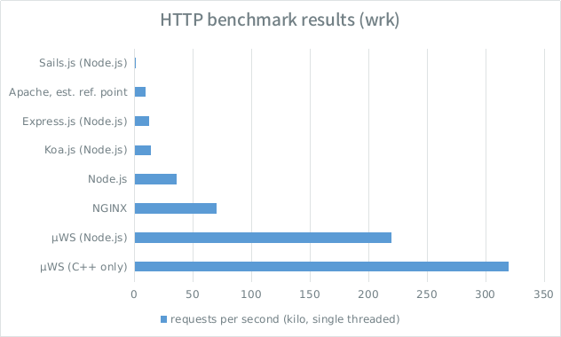
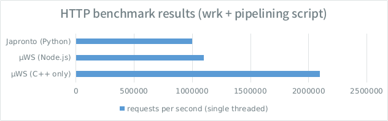

<div align="center"></div>
`µWS` is one of the most lightweight, efficient & scalable WebSocket & HTTP server implementations available. It features an easy-to-use, fully async object-oriented interface and scales to millions of connections using only a fraction of memory compared to the competition. While performance and scalability are two of our top priorities, we consider security, stability and standards compliance paramount. License is zlib/libpng (very permissive & suits commercial applications).

* Autobahn tests [all pass](http://htmlpreview.github.io/?https://github.com/uWebSockets/uWebSockets/blob/master/autobahn/index.html).
* Significantly outperforms `WebSocket++`, `libwebsockets`, `Beast`, `Crow`, `Gorilla`, `Kaazing Gateway`, `ws` and `Socket.IO` in every tested dimension (see benchmark table below).
* Outperforms `Apache`, `Node.js`, `NGINX` by at least 4x in HTTP requests per second.
* Linux, OS X & Windows support.
* Valgrind / AddressSanitizer clean.
* Built-in load balancing and multi-core scalability.
* SSL/TLS support & integrates with foreign HTTPS servers.
* Permessage-deflate built-in.
* Node.js binding exposed as the well-known `ws` interface (`uws` is at least 20x faster and 20x more scalable).

[](https://badge.fury.io/js/uws) [](https://travis-ci.org/uWebSockets/uWebSockets) [](https://www.patreon.com/uWebSockets)

## Benchmarks table - [validate](https://github.com/alexhultman/uWebSockets/tree/master/benchmarks#websocket-echo-server-benchmarks)
Implementation | User space memory scaling | Connection performance | Short message throughput | Huge message throughput
--- | --- | --- | --- | ---
Beast 1.0.0 b17 | µWS is **7x** as lightweight :+1: | µWS is **4x** as performant | µWS is **22x** as performant | µWS is **3x** as performant
libwebsockets 2.0 | µWS is **11x** as lightweight | µWS is **equal** in performance :+1: | µWS is **6x** as performant | µWS is **4x** as performant
Crow [Sep 21] | µWS is **13x** as lightweight | µWS is **2x** as performant | µWS is **12x** as performant | unable to measure
Gorilla e8f0f8a | µWS is **46x** as lightweight | µWS is **3x** as performant | µWS is **5x** as performant :open_mouth: | data missing
ws v1.1.0 + binary addons | µWS is **47x** as lightweight | µWS is **18x** as performant | µWS is **33x** as performant | µWS is **2x** as performant
Kaazing Gateway Community 5.0.0 | µWS is **62x** as lightweight | µWS is **15x** as performant | µWS is **18x** as performant | unable to measure
Socket.IO 1.5.1 | µWS is **62x** as lightweight | µWS is **42x** as performant :-1: | µWS is **61x** as performant :-1: | data missing
WebSocket++ v0.7.0 | µWS is **63x** as lightweight :-1: | µWS is **4x** as performant | µWS is **3x** as performant :+1: | µWS is **2x** as performant :+1:

*Benchmarks are run with default settings in all libraries, except for `ws` which is run with the native performance addons. These results were achieved with the native C++ server, not the Node.js addon. Expect worse performance and scalability when using Node.js (don't worry, the Node.js addon will run circles around `ws`).*

### HTTP benchmarks


*HTTP 1.1 benchmark using wrk. All servers but Apache are single threaded and all serve a static page with no PHP, database queries or similar. Apache performance is estimated by dividing its multi-process performance by number of CPU cores.*



*Experimental HTTP 1.1 benchmark using wrk + Japronto's own (ridiculous) pipeline script.*

## Built with µWS
<div align="center"></div>

## Usage

### C++
`µWebSockets` is a high performance C++ library with optional bindings to Node.js. It is greatly recommended investing in a proper C++ implementation if performance and memory scalability is considered critical for the solution in whole. The C++ interface has been designed for simplicity and only requires you to write a few lines of code to get a working server:

```c++
#include <uWS.h>

int main()
{
    uWS::Hub h;

    h.onMessage([](uWS::WebSocket<uWS::SERVER> ws, char *message, size_t length, uWS::OpCode opCode) {
        ws.send(message, length, opCode);
    });

    h.listen(3000);
    h.run();
}
```

### Node.js
We built `µWS` with the existing Node.js infrastructure in mind. That's why we target the widespread `ws` interface, allowing us to seamlessly integrate with already existing projects. You simply swap `require('ws')` with `require('uws')`:

```javascript
var WebSocketServer = require('uws').Server;
var wss = new WebSocketServer({ port: 3000 });

function onMessage(message) {
    console.log('received: ' + message);
}

wss.on('connection', function(ws) {
    ws.on('message', onMessage);
    ws.send('something');
});
```

##### Deviations from ws
There are some important incompatibilities with `ws` though, we aim to be ~90% compatible but will never implement behavior that is deemed too inefficient:

* Binary data is passed zero-copy as an `ArrayBuffer`. This means you need to copy it to keep it past the callback. It also means you need to convert it with `Buffer.from(message)` if you expect a `Node.js Buffer`.
* `webSocket._socket` is not a `net.Socket`, it is just a getter function with very basic functionalities.
* `webSocket._socket.remote...` might fail, you need to cache it at connection.
* `webSocket` acts like an `EventEmitter` with one listener per event maximum.
* `webSocket.upgradeReq` is only valid during execution of the connection handler. If you want to keep properties of the upgradeReq for the entire lifetime of the webSocket you better attach that specific property to the webSocket at connection.

##### Notable projects defaulting to µWS
`µWS` is the default engine in recent versions of [deepstream.io](http://deepstream.io/), [SocketCluster](http://socketcluster.io) and [Socket.IO](http://socket.io).

*While having a fast low level engine by default certainly helps when it comes to efficiency, you still need to watch out for wrapper overhead. Some of these projects have been shown to add up to 10x in throughput overhead. Always check your numbers before jumping the gun. Take Sails.js for one, it wraps ExpressJS and performs 13x worse than ExpressJS, while ExpressJS wraps Node.js and performs 3x worse than Node.js. Comparing Sails.js with µWS in HTTP requests per second gives a 300x difference in performance. Many projects in the Node.js sphere are just wrappers of wrappers of wrappers which add astronomical overhead. Roughly speaking, the fewer NPM modules you can use the better.*

##### Not quite there yet
You can set 'uws' as transformer in **Primus**:
```javascript
var primus = new Primus(server, { transformer: 'uws' });
```

## Installation
### Node.js developers
[](https://www.npmjs.com/package/uws)

* Node.js 4.x, 5.x & 6.x supported (Windows version requires Node.js 6.4.0+)
* Linux, Mac OS X & Windows supported
* `gcc` >= 4.8.0 and `make` (or compatible) are required to build from source. This translates to Visual Studio >= 2015 on Windows and Clang >= 3.3 on macOS.

On installation, the module will be attempted to be build from source. If that fails, it will attempt to fall back to prebuilt modules which are provided for most platforms. If that fails too, `uws` will throw on `require`.

### C++ developers
#### Dependencies
First of all you need to install the required dependencies. On Unix systems this is typically done via package managers, like [homebrew](http://brew.sh) in the case of OS X or `dnf` in the case of Fedora Linux. On Windows you need to search the web for pre-compiled binaries or simply compile the dependencies yourself.

* libuv 1.3+
* OpenSSL 1.0.x
* zlib 1.x
* CMake 3.x

#### Compilation
Obviously you will need to clone this repo to get the sources. We use CMake as build system.

* `git clone https://github.com/uWebSockets/uWebSockets.git && cd uWebSockets`
* `cmake .`

Now, on Unix systems it should work by simply running `make`. Run [sudo] `make install` as you wish.

##### Windows, in all its glory
If you are running Windows you should now have a bunch of Visual Studio project files and one solution file. Open the solution file, now you need to make sure the header include paths and library paths are all set according to where you installed the dependencies. You might also need to change the names of the libraries being linked against, all according to the names of the installed library files. You know the drill.
