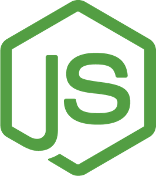
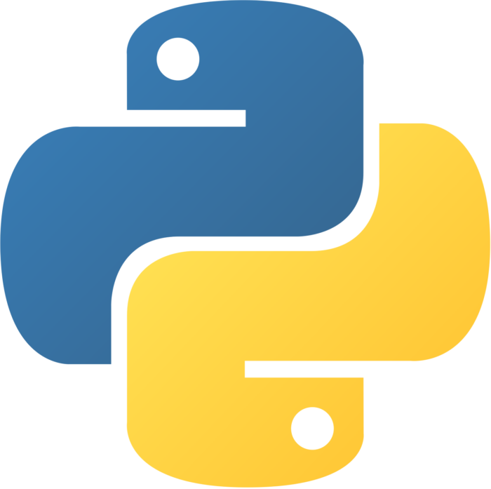

<div align="center">
<br>
<i>Simple, secure</i><sup><a href="https://github.com/uNetworking/uWebSockets/tree/master/fuzzing#fuzz-testing-of-various-parsers-and-mocked-examples">[1]</a></sup><i> & standards compliant</i><sup><a href="https://unetworking.github.io/uWebSockets.js/report.pdf">[2]</a></sup><i> web server for the most demanding</i><sup><a href="https://github.com/uNetworking/uWebSockets/tree/master/benchmarks#benchmark-driven-development">[3]</a></sup><i> of applications.</i> <a href="https://github.com/uNetworking/uWebSockets/blob/master/misc/READMORE.md">Read more...</a>
<br><br>


<a href="https://github.com/uNetworking/uWebSockets/releases"></a> <a href="https://lgtm.com/projects/g/uNetworking/uWebSockets/context:cpp"></a> 

</div>
<br><br>

### :closed_lock_with_key: Optimized security
Being meticulously optimized for speed and memory footprint, µWebSockets is fast enough to do encrypted TLS 1.3 messaging quicker than most alternative servers can do even unencrypted, cleartext messaging<sup><a href="https://github.com/uNetworking/uWebSockets/tree/master/benchmarks#benchmark-driven-development">[3]</a></sup>.

Furthermore, we partake in Google's OSS-Fuzz with a ~90% daily fuzzing coverage with no sanitizer issues. LGTM scores us flawless A+ from having zero CodeQL alerts.


### :arrow_forward: Rapid scripting
µWebSockets is written entirely in C & C++ but has seamless integrations for both <a href="https://github.com/uNetworking/uWebSockets.py">Python3</a> and <a href="https://github.com/uNetworking/uWebSockets.js">Node.js</a> backends. This allows for rapid scripting of powerful apps, in your favorite environment.

&nbsp;&nbsp;

### :battery: Batteries included
Designed around a convenient URL router with wildcard & parameter support - paired with efficient pub/sub features inspired by MQTT. µWebSockets should be the obvious, complete starting point for any real-time web project with high demands.

Start building your Http & WebSocket apps in a swift; <a href="https://github.com/uNetworking/uWebSockets/blob/master/misc/READMORE.md">read the user manual</a> and <a href="https://github.com/uNetworking/uWebSockets/tree/master/examples">see examples</a>. You can browse our <a href="https://unetworking.github.io/uWebSockets.js/generated/">TypeDoc</a> for a quick overview.

```c++
uWS::SSLApp({

    /* There are tons of SSL options, see uSockets */
    .cert_file_name = "cert.pem",
    .key_file_name = "key.pem"
    
}).get("/hello", [](auto *res, auto *req) {

    /* You can efficiently stream huge files too */
    res->writeHeader("Content-Type", "text/html; charset=utf-8")->end("Hello HTTP!");
    
}).ws<UserData>("/*", {

    /* Just a few of the available handlers */
    .open = [](auto *ws, auto *req) {
        /* MQTT syntax */
        ws->subscribe("sensors/+/house");
    },
    .message = [](auto *ws, std::string_view message, uWS::OpCode opCode) {
        ws->send(message, opCode);
    }
    
}).listen(9001, [](auto *listenSocket) {

    if (listenSocket) {
        std::cout << "Listening on port " << 9001 << std::endl;
    }
    
}).run();
```
### :briefcase: Commercially supported
<a href="https://github.com/uNetworking">uNetworking AB</a> is a Swedish consulting & contracting company dealing with anything related to µWebSockets; development, support and customer success.

Don't hesitate <a href="mailto:alexhultman@gmail.com">sending a mail</a> if you're building something large, in need of advice or having other business inquiries in mind. We'll figure out what's best for both parties and make sure you're not stepping into one of the many common pitfalls.

Special thanks to BitMEX, Bitfinex, Google, Coinbase, Bitwyre and deepstreamHub for allowing the project itself to thrive on GitHub since 2016 - this project would not be possible without these beautiful companies.


### :jigsaw: Pluggable architecture
µWebSockets builds on <a href="https://github.com/uNetworking/uSockets">µSockets</a>, a foundation library implementing eventing, networking and cryptography in three different layers. Every layer has multiple implementations and you control the compiled composition with flags.

In a nutshell:

* `WITH_WOLFSSL=1 WITH_LIBUV=1 make examples` builds examples utilizing WolfSSL and libuv
* `WITH_OPENSSL=1 make examples` builds examples utilizing OpenSSL and the native kernel

See µSockets for an up-to-date list of flags and a more detailed explanation.

### :handshake: Permissively licensed
Intellectual property, all rights reserved.

Apache License 2.0 is a permissive license with few limitations. Make sure you properly understand the concept of licenses and how they relate to copyright & trademark laws. If you're uncertain about your permissions, please ask before assuming.
