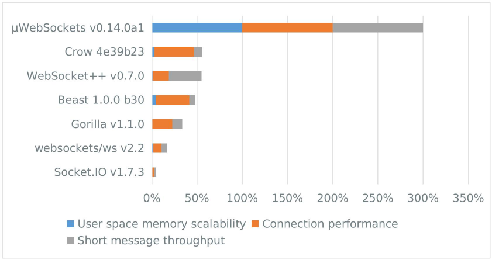

<div align="center"></div>

`µWS` is one of the most lightweight, efficient & scalable WebSocket & HTTP server implementations available. It features an easy-to-use, fully async object-oriented interface and scales to millions of connections using only a fraction of memory compared to the competition. While performance and scalability are two of our top priorities, we consider security, stability and standards compliance paramount. License is zlib/libpng (very permissive & suits commercial applications).


* Autobahn tests [all pass](http://htmlpreview.github.io/?https://github.com/uWebSockets/uWebSockets/blob/master/misc/autobahn/index.html).
* One million WebSockets require ~111mb of user space memory (104 bytes per WebSocket).
* Single-threaded throughput of up to 5 million HTTP req/sec or 20 million WebSocket echoes/sec.
* Linux, OS X, Windows & [Node.js](http://github.com/uWebSockets/bindings) support.
* Runs with raw epoll, libuv or ASIO (C++17-ready).
* Valgrind & AddressSanitizer clean.
* Permessage-deflate, SSL/TLS support & integrates with foreign HTTP(S) servers.
* Multi-core friendly & optionally thread-safe via compiler flag UWS_THREADSAFE.

[](https://travis-ci.org/uWebSockets/uWebSockets)

## Simple & modern
The interface has been designed for simplicity and only requires you to write a few lines of code to get a working server:
```c++
#include <uWS/uWS.h>

int main() {
    uWS::Hub h;

    h.onMessage([](uWS::WebSocket<uWS::SERVER> *ws, char *message, size_t length, uWS::OpCode opCode) {
        ws->send(message, length, opCode);
    });

    h.onHttpRequest([](uWS::HttpResponse *res, uWS::HttpRequest req, char *data, size_t length, size_t remainingBytes) {
        res->end(const char *, size_t);
    });

    h.listen(3000);
    h.run();
}
```
Get the sources of the uws.chat server [here](https://github.com/uWebSockets/website/blob/master/main.cpp). Learn from the tests [here](tests/main.cpp).

## Not your average server
µWS was designed to perform well across the board, not just in one specific dimension. With excellent memory usage paired with high throughput it outscales Socket.IO by 180x.

<div align="center"></div>

*Benchmarks are run with default settings in all libraries, except for `ws` which is run with the native performance addons. Read more about the benchmarks [here](benchmarks).*

## Perfect for WebRTC
Distributed WebRTC networks typically employ WebSockets for peer signalling. Since every single peer in the entire distributed network requires a persistent connection to the signalling server at all times, only a scalable WebSocket server will do.

## Getting started
#### Dependencies
First of all you need to install the required dependencies. This is very easily done with a good open source package manager like [Homebrew](http://brew.sh) for OS X, [vcpkg](https://github.com/Microsoft/vcpkg) for Windows or your native Linux package manager.

* OpenSSL 1.x.x
* zlib 1.x
* libuv 1.3+ *or* Boost.Asio 1.x (both optional on Linux)

If you wish to integrate with a specific event-loop you can define `USE_ASIO` or `USE_LIBUV` as a global compilation flag and then link to respective libraries. `USE_EPOLL` is default on Linux while other systems default to `USE_LIBUV`.

* Fedora: `sudo dnf install openssl-devel zlib-devel`
* Homebrew: `brew install openssl zlib libuv`
* Vcpkg: `vcpkg install openssl zlib libuv` *and/or* `vcpkg install openssl:x64-windows zlib:x64-windows libuv:x64-windows`

#### Compilation
###### OS X & Linux
* `make`
* `sudo make install` (or as you wish)
###### Windows
* Compile `VC++.vcxproj` with Visual C++ Community Edition 2015 or later.
